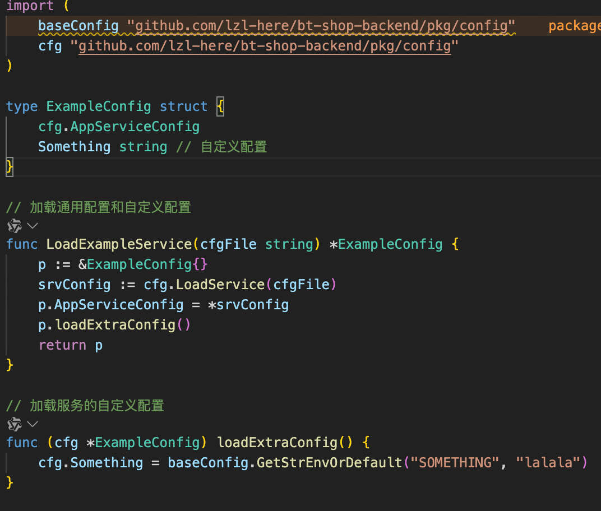

## 项目目录
``` shell
.
├── Makefile.      # 全局构建脚本，通过proto生成代码
├── apps           # 项目文件夹， 服务 + 网关
│   ├── example. 
│   ├── gateway
│   ├── goods
│   ├── order
│   ├── pay
│   └── user
├── deploy         # 部署相关，后续sql放这，并且加入一键部署所有服务 
├── go.mod
├── go.sum
├── kitex_gen      # 通过proto生成的代码 
├── pkg            # 公共包
├── protobuf       # proto文件
└── todo.txt       
```


## 迭代方式

1. 假如需要新增服务，在项目根目录下的protobuf中的proto下编写proto文件

2. 每个服务对应一个文件夹，详情查看example，一个文件对应server: XXX_server.proto，其他的一个文件对应一个接口

3. 编写完成后使用Makefile进行生成golang代码： make gen


## 项目启动
每个服务下创建makefile文件，进入到服务文件夹下，make dev执行

## 项目依赖
0. golang
1. kitex
2. proto，以及proto的golang插件
3. mysql
4. redis
5. etcd
6. makefile

后续引入es + 健康监控


## pkg
定义一些不同服务之间通用的代码，比如配置，中间件

``` shell
├── config             # 服务配置相关，定义了服务之间通的配置，比如mysql，redis，grpc端口号
│   ├── cfg.go          
│   ├── config.go
│   ├── load.go
│   └── repo.go
├── middleware         # 定义了基础中间件，错误处理和日志打印，其他服务自定义的中间件放在服务自己的文件夹下
│   ├── error_md.go
│   └── log_md.go
└── model              
    └── base_model.go
```

因为不同服务之间会有自定义的配置，所以服务需要组合AppServiceConfig使用，详情查看example服务:


