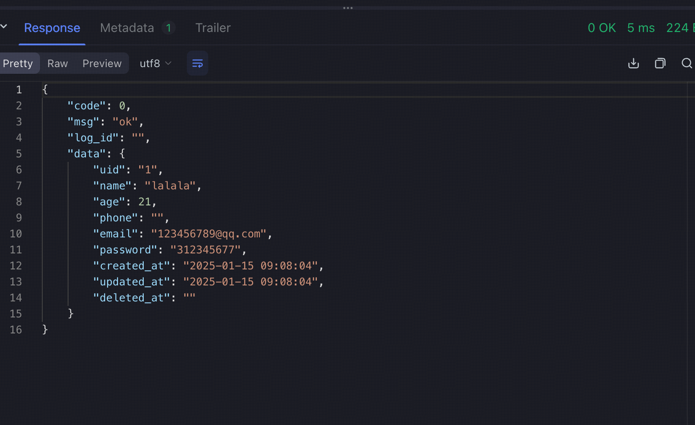

## 项目结构

``` shell
.
├── Makefile                # 执行代码的脚本，make dev本地启动
├── README.md               
├── bin                     # 存放程序的二进制文件
│   └── example                 # 程序的二进制文件名，在根目录的makefile中定义的名字
├── cmd                     # 程序入口
│   ├── logs                    # 日志文件
│   └── main.go                 # 程序入口
├── config
│   └── example_config.go   # 服务配置相关
├── deploy                  # 部署服务相关
│   └── person.sql
├── internal                # 业务代码
│   ├── api                     # 接口层 (controller)
│   │   └── example_server.go
│   ├── domain                  # 领域层
│   │   └── model
│   │       └── person.go
│   ├── handler                 # 业务逻辑层 (service)
│   │   ├── person_h.go
│   │   └── ping_h.go
│   └── repo                    # 数据访问层 (dao)
│       └── repo.go
├── pkg                         # 公共包
│   └── bizerr.go                   # example下的业务错误码
└── script                      # 脚本

```

1. 前置中间件：mysql，redis，etcd，需要安装好后在.env.production中进行配置后再启动
2. 然后执行deploy下的sql
3. 使用make dev进行项目启动

成功后用grpc客户端对接口进行测试：



导入proto生成代码：
``` golang
import (
	egen "github.com/lzl-here/bt-shop-backend/kitex_gen/example"
)
```


example 服务的 vscode 的 debug启动的配置文件: 
``` json
{
    "version": "0.2.0",
    "configurations": [
        {
            "name": "example",
            "type": "go",
            "request": "launch",
            "mode": "auto",
            "program": "${workspaceFolder}/cmd/main.go",
            "args": [
                "--cfgFile", "${workspaceFolder}/.env.production",
            ]
        }
    ]
}
```

