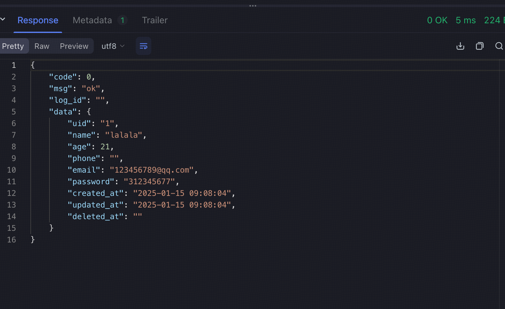

## 项目结构

``` shell
.
├── Makefile   # 构建脚本
├── README.md. 
├── bin
│   └── example # 程序的二进制启动文件
├── cmd
│   ├── logs
│   │   └── app.log # 日志存储文件
│   └── main.go     # 程序入口文件
├── deploy          # 部署程序的前置文件
│   └── person.sql  
└── internal        # 业务逻辑代码
    ├── api         # 业务处理层
    │   ├── handler 
    │   │   ├── person_h.go
    │   │   └── ping_h.go
    │   └── middleware
    ├── domain.    # 领域层
    │   └── model
    │       └── person.go
    ├── repo    # 数据访问层
    │   └── repo.go
    └── server  # rpc入口，接口层
        └── example_ctl.go

```

1. 目前前置中间件：mysql，redis，etcd，需要安装好后在.env.production中进行配置后再启动
2. 然后执行deploy下的sql
3. 使用make dev进行项目启动

成功后用grpc客户端对接口进行测试：

